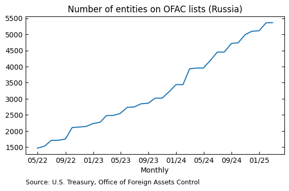
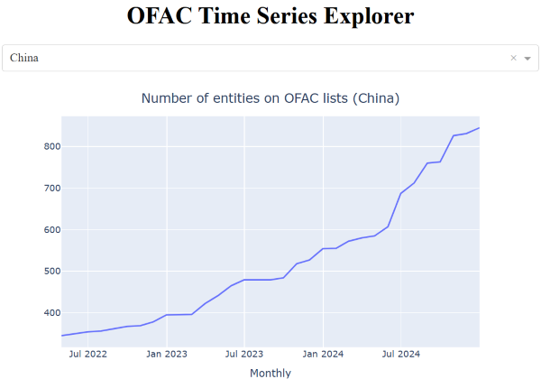

# OFAC Sanctions List Processor

A Python system for managing OFAC sanctions data on a monthly basis. The system is particularly suited for research applications, providing historical tracking of sanctions and a monthly panel dataset for analysis. It is not designed for sanctions screening. 

Data collection began in April 2022. The data are updated at the end of each month.  

## Data Outputs

The system produces two datasets, which ship in the `data/` folder. Researchers who are only interested in the datasets can simply download them for further use. 

### OFAC List (ofac_list.csv)
Record of sanctioned entities with temporal tracking. All dates are end-of-month. Key temporal fields: 

- **Rep_date**: Month-end date when information was observed/reported beginning in April 2022
- **add_date**: Month-end date when entity-country pair first appeared on sanctions list. Entities that were on the list when data collection began are assigned April 30, 2022 as the add_date. 
- **removal_date**: Month-end date when entity-country pair was removed from list (if applicable)

### Panel Dataset (ofac_panel.csv)
Monthly panel of sanctions by country with the following fields:

- **Country**: Country name
- **Date**: Month-end date
- **yrqtr**: Year-quarter (e.g., 2024Q1)
- **yrmon**: Year-month (e.g., 2024-01)
- **levels**: Total number of active sanctioned entities
- **additions**: Number of new entities added in this month
- **removals**: Number of entities removed in this month
- **change**: Net change in sanctioned entities (additions - removals)

## Usage

`monthly-download.py` is the main script for updating the OFAC data and saving the datasets to the `data/` folder. 

Additional usage examples are provided below.

### Data Processing

```python
from ofac import OFACProcessor

# Initialize processor
processor = OFACProcessor()

# Update OFAC list with current data
ofac_list = processor.update_ofac_list()

# Create panel dataset
panel = processor.create_panel(ofac_list)
```
### Vizualization

The system also includes functionality to create time series plots for a given country: 

```python
from ofac import plot_ofac_series

plot_ofac_series(panel, country='Russia', var='levels')
```


Finally, users can run the Dash application `app.py` to explore the panel interactively:



## System Details

The system handles three key tasks:
1. Downloads and processes current sanctions data
   - Combines SDN and Consolidated lists
   - Handles many-to-many relationships between entities and their alternate names/addresses

2. Maintains historical record (ofac_list.csv)
   - Tracks when entities are added to and removed from lists
   - Preserves all information changes (new addresses, programs, etc.)
   - Records addition and removal dates

3. Generates panel data (ofac_panel.csv)
   - Monthly counts of sanctioned entities by country
   - Tracks additions and removals
   - Shows both gross and net changes
   - Maintains running total of active sanctions

## License
MIT License
